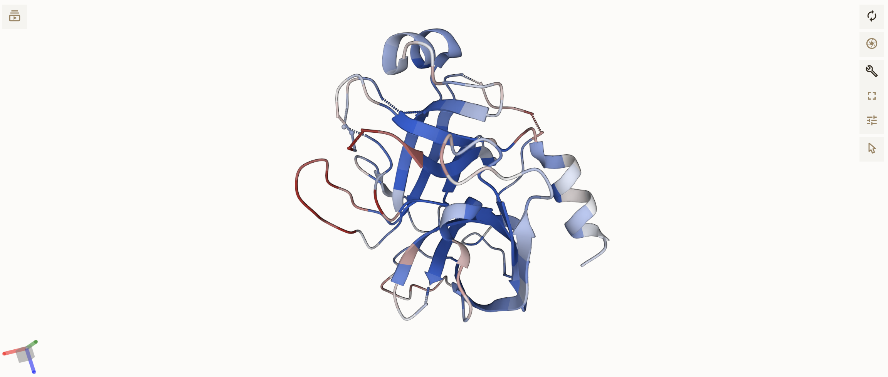

# ScanNet predicts Binding Sites

#### Multi-Chain input PDB
If your PDB file has multiple chains then you can specify the chain by renaming the file to:

`some_name.pdb_A` for the A chain 
 

or

`some_name.pdb_B` for the B chain

#### Output Visualization
The visualization colors each residue based on its binding site probability.

Red is high binding site probability

Blue is low binding site probability

